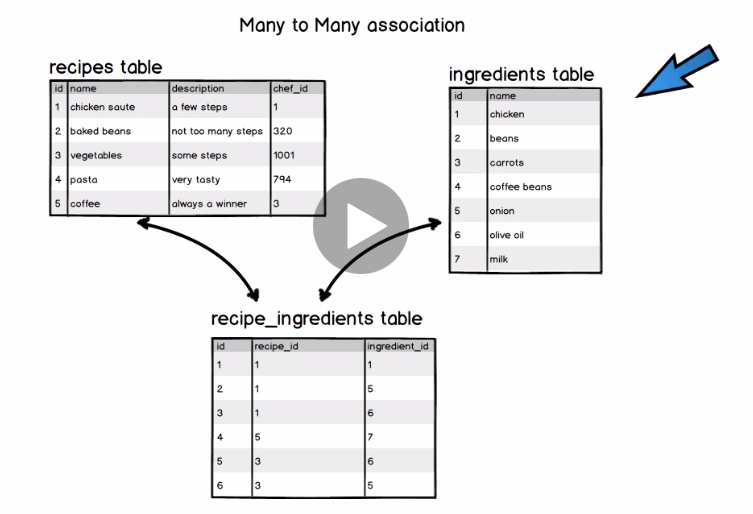
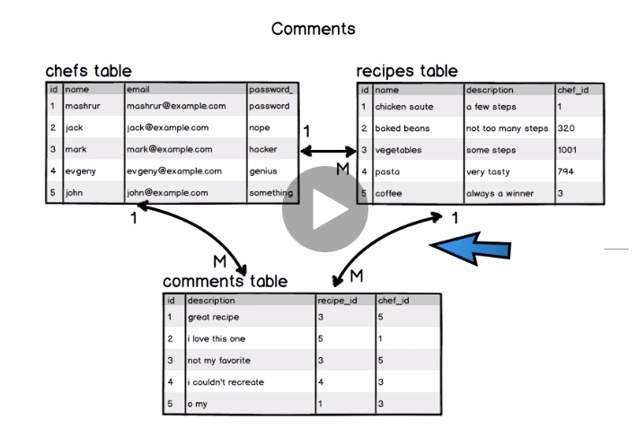

# README
Skip adding ActiveStorage on new builds https://mikerogers.io/2018/04/13/remove-activestorage-from-rails-5-2.html
Create new myrecipes app
$ rails new myrecipes --skip-active-storage

## change below for heroku
- replace `sqlite3` to `pg` in Gemfile
- update `adapter:` and `database:` in config/database.yml to
`adapter: postgresql`
- change the database: to a custom name
`database: my_database_development`
`database: my_database_test`
`database: my_database_production`

## for guard and LiveReload on webpage
- add `'guard' 'guard-rspec' 'guard-livereload' 'rb-readline' 'pry-coolline'` into Gemfile `group :development, :test ` to run guard LiveReload
- add `guardfile` to app directory

## deploy on heroku 
https://devcenter.heroku.com/articles/git
$ heroku create
Creating app... done, ⬢ peaceful-cliffs-10078
https://peaceful-cliffs-10078.herokuapp.com/ | https://git.heroku.com/peaceful-cliffs-10078.git
$ heroku git:remote -a peaceful-cliffs-10078
$ git push heroku master <!--  or -->
$ git push heroku master --no-verify
    --- remote:        https://peaceful-cliffs-10078.herokuapp.com/ deployed to Heroku
>>if `error: src refspec master does not match any
error: failed to push some refs to 'https://git.heroku.com/hw-myrecipes005.git'`
$ git push heroku HEAD:master

$ heroku run rails db:migrate

# 42 notes ===========================
https://try.ruby-lang.org/
## Minitest
Layout of the application

## integration testing
## Model Tests - unit testing
$ rails g integration_test pages
$ rails test
TDD - design the app functionality based on a test first approach
Write the test for the functionality
Build minimum code necessary to make each test pass

Re-factor the code - *code doesn't smell* - clean code, confidence
Look at some sample layouts for homepage, and come up with a homepage design

1. Create a mockup! Or use Bootstrap
Bootstrap
https://getbootstrap.com/docs/3.3/getting-started/
Using this template
https://getbootstrap.com/docs/3.3/examples/jumbotron/

# 46 notes ===========================
learn to code html & css
https://learn.shayhowe.com/

# 48 notes ===========================
copy navigation bar from website
https://getbootstrap.com/docs/3.3/components/#navbar

for css color
google `htom color picker` use #073815 for green

- use bootstrap `jumbotron` example as body style in 
home.html.erb

- add `yield` field into `container`
app/views/layouts/application.html.erb
    

      <%= yield %>
    

- change text align to center
home.html.erb
    
 

custom.css.scss add
    .center {
        text-align: center;
    }

# 50 notes ===========================
- change background
https://unsplash.com/

- add three column on home page
https://getbootstrap.com/docs/3.3/examples/justified-nav/
choose example, right click -> view page source
<!-- Example row of columns -->
copy below 

<!-- Site footer -->

- homework
Assignment: Create the footer, add styling and then paste an image of it to the Q & A!
deploy this application
# 54 notes ===========================
database and 1:m associations

- Relational Databased
- SQL - Structured Query Language
- ActiveRecord - abstraction - Ruby - translated to SQ
L

## Database layer, Associations
1:m -- one to many
m:m -- many to many
Object Relational Mapper - ORM
Relational Database
Virtual atrributes are
ORM

e.g. Database
aritcles
ID      title           description                     user_id
1       Great Weather   Great Weather outside today     3
2       Second Article  Today is great day of coding    2
3       ...              ...                            6
...

users
ID      username    email
1       joe         joe@example.com
2
3
...
6
...

hans_many // on the one side
belongs_to // on the many side

## Relational Database
goto Todo app

# 56 notes ===========================
Switch back from todoapp

# 56 notes ===========================
Recipes
ID, name, descrtiption, chef_id

Chefs
ID, name, email

# 56 notes ===========================
Recipe 
- recipe should be valid
- name should be present
- description should be present 
- chef_id should be present -- later **
- maximum length for name and description, maybe a minimum for description

Chef
- chefname should be present
- email should be present
- size restrictions on email and chefname
- email address should be valid format
- email should be unique, case insensitive

# 58 notes ===========================
> @m = Recipe.new
> Recipe
 => Recipe(id: integer, name: string, description: text, created_at: datetime, updated_at: datetime) 

> @m = Recipe.new(name: "", description: "")
 => #<Recipe id: nil, name: "", description: "", created_at: nil, updated_at: nil> 
> @m.save
  (0.3ms)  BEGIN
  Recipe Create (2.2ms)  INSERT INTO "recipes" ("name", "description", "created_at", "updated_at") VALUES ($1, $2, $3, $4) RETURNING "id"  [["name", ""], ["description", ""], ["created_at", "2020-03-24 15:02:17.239771"], ["updated_at", "2020-03-24 15:02:17.239771"]]
   (0.4ms)  COMMIT
 => true 

 ## add validateion
 add `validates :name, presence: true` in recipe.rb
 > @m = Recipe.new(name: "", description: "")
 => #<Recipe id: nil, name: "", description: "", created_at: nil, updated_at: nil> 
> @m.save <!-- can't be saved after validates applied -->
   (0.3ms)  BEGIN
   (0.2ms)  ROLLBACK
 => false 
> @m.errors.any?
 => true 
> @m.errors.full_messages
 => ["Name can't be blank"] 
> Recipe.delete_all <!-- delete all data -->
  Recipe Destroy (0.8ms)  DELETE FROM "recipes"
 => 1 

## homework
build Chefs database

## testing
read https://guides.rubyonrails.org/testing.html#available-assertions
require 'test_helper'

class RecipeTest < ActiveSupport::TestCase
    def setup
        @recipe = Recipe.new(name: "vegetable", description: "great vegetable recipe")
    end
    test "recipe should be valid" do
        assert @recipe.valid?
    end
end
$ rails test <!-- run test -->
    #validates :name, presence: true <!-- comment this in recipe.rb -->
<!-- add below in recipe_test.rb, then test will be failed -->
    test 'name should be present' do
        @recipe.name = " "
        assert_not @recipe.valid?
    end
$ rails test
Expected true to be nil or false
then remove comment test again, the testing should be passed

# 60 notes ===========================
test regex format by using https://rubular.com/

# 64 notes ===========================
one to many association
> @c = Chef.new(chefname: "m", email: "m@example.com")
> @c.save
<!-- create can hit our db -->
> @c1 = Chef.create(chefname: "john", email: "john@example.com")
> Chef.all <!-- we have two chefs -->
  Chef Load (0.3ms)  SELECT  "chefs".* FROM "chefs" LIMIT $1  [["LIMIT", 11]]
 => #<ActiveRecord::Relation [
     #<Chef id: 1, chefname: "m", email: "m@example.com", created_at: "2020-03-24 18:49:51", updated_at: "2020-03-24 18:49:51">, 
     #<Chef id: 2, chefname: "john", email: "john@example.com", created_at: "2020-03-24 18:52:52", updated_at: "2020-03-24 18:52:52">]> 

<!-- Since chef has associate to recipes, we can create recipes automatically assign to the chef using below command -->
> chef = Chef.last
> recipe = chef.recipes.build(name: "italian vegetables", description: "amazing italian vegetables cooked for 20 minutes")
 => #<Recipe id: nil, name: "italian vegetables", description: "amazing italian vegetables cooked for 20 minutes", created_at: nil, updated_at: nil, chef_id: 2> 
> recipe.save
    (0.2ms)  BEGIN
  Recipe Create (0.4ms)  INSERT INTO "recipes" ("name", "description", "created_at", "updated_at", "chef_id") VALUES ($1, $2, $3, $4, $5) RETURNING "id"  [["name", "italian vegetables"], ["description", "amazing italian vegetables cooked for 20 minutes"], ["created_at", "2020-03-24 19:01:38.077213"], ["updated_at", "2020-03-24 19:01:38.077213"], ["chef_id", 2]]
   (0.4ms)  COMMIT
 => true 
> recipe.chef 
=> #<Chef id: 2, chefname: "john", email: "john@example.com", created_at: "2020-03-24 18:52:52", updated_at: "2020-03-24 18:52:52"> 
> recipe.chef.chefname
=> "john" 
<!-- forget below error, I got this correct later after create new recipe. Don't know why and how -->
        <!-- below command I have different disply here than Udemy lecture -->
        > recipe.chef 
        <!-- in Udemy got chef info -->
        => #<Chef id: 2, chefname: "john", email: "john@example.com", created_at: "2020-03-24 18:52:52", updated_at: "2020-03-24 18:52:52"> 
        <!-- but I got error --> 
            Traceback (most recent call last):
                    1: from (irb):94
            NoMethodError (undefined method `chef' for #<Recipe:0x00007fb6599715a0>)
            Did you mean?  chef_id

> chef.recipes <!-- this works -->
  Recipe Load (0.2ms)  SELECT  "recipes".* FROM "recipes" WHERE "recipes"."chef_id" = $1 LIMIT $2  [["chef_id", 2], ["LIMIT", 11]]
 => #<ActiveRecord::Associations::CollectionProxy [#<Recipe id: 2, name: "italian vegetables", description: "amazing italian vegetables cooked for 20 minutes", created_at: "2020-03-24 19:01:38", updated_at: "2020-03-24 19:01:38", chef_id: 2>]> 

> recipe = Recipe.create(name: "vegetable saute", description: "lots of vegetables cooked inoil for 15 min", chef_id: 2)
> chef.recipes
  Recipe Load (0.3ms)  SELECT  "recipes".* FROM "recipes" WHERE "recipes"."chef_id" = $1 LIMIT $2  [["chef_id", 2], ["LIMIT", 11]]
 => #<ActiveRecord::Associations::CollectionProxy [
     #<Recipe id: 2, name: "italian vegetables", description: "amazing italian vegetables cooked for 20 minutes", created_at: "2020-03-24 19:01:38", updated_at: "2020-03-24 19:01:38", chef_id: 2>, 
     #<Recipe id: 3, name: "vegetable saute", description: "lots of vegetables cooked inoil for 15 min", created_at: "2020-03-24 19:47:37", updated_at: "2020-03-24 19:47:37", chef_id: 2>]> 

-- or -- 
> recipe = Recipe.new(name: "vegetable saute", description: "lots of vegetables cooked inoil for 15 min")
> chef.recipes << recipe <!-- insert, hit db, auto assign to chef -->

# 66 notes ===========================
back to web
Prefix       Verb     URI Pattern                Controller#Action
root        GET     /                           pages#home
pages_home  GET     /pages/home(.:format)       pages#home
new_recipe  GET     /recipes/new                recipes#new         #display a new form
            POST    /recipes                    recipes#create      #submit the information from the form
edit_recipe GET     /recipes/:id/edit           recipes#edit        #display on edit form
            PATCH   /recipes/:id                recipes#update      #submit the edited form information
recipe      GET     /recipes/:id                recipes#show        #display a particular recipe
            DELETE  /recipes/:id                recipes#destroy     #deletes a particular recipe --- **specify DELETE to get destroy action**

# 67 notes ===========================
$ rails g integration_test recipes

# 73 notes ===========================
https://en.gravatar.com/

## refactor code 
- make a new file `app/views/shared/_page_title.html.erb` to share refactor code 
<h1 align="center"><%= title.capitalize %> </h1>

- replace below code in related page.
<%= render "shared/page_title", title: "Show all recipes" %>

## Gravatar
`app/helpers/application_helper.rb` method(s) inside are available to your views

# 75 notes ===========================
Build new recipe page
https://getbootstrap.com/docs/3.3/css/#forms
you can use form from above page, but don't use <form></form>tag, you can copy and paste code between <form></form> tag, but don't cope this tag, it will get you the trouble when you use this in ruby

## read through
https://guides.rubyonrails.org/form_helpers.html

# 89 notes ===========================
$ rails g integration_test recipes_edit
run specific test
$ rails test test/integration/recipes_edit_test.rb
# 93 notes ===========================
$ git push heroku HEAD:master
$ heroku run rails db:migrate
$ heroku run rails console
# Section 5 #99 notes ===========================
has secure password
https://api.rubyonrails.org/classes/ActiveModel/SecurePassword/ClassMethods.htm

`gem 'bcrypt', '~> 3.1.7'` uncomment this in Gemfile
add `password_digest` in schema
$ rails g migration add_password_digest_to_chefs

password
password_confirmation
authenticate

> chef = Chef.last
> chef.password = "password"
> chef
 => #<Chef id: 3, chefname: "mashrur", email: "mashrur.hossain@gmail.com", created_at: "2020-03-25 14:45:34", updated_at: "2020-03-25 14:46:42", password_digest: "$2a$12$9W6Q0g7ZXpoYqQ6x34wql.ZReG7n0MuamMpdmMWt8oW..."> 
> chef.authenticate('nottherightpassword')
 => false 
> chef.authenticate('password')
 => #<Chef id: 3, chefname: "mashrur", email: "mashrur.hossain@gmail.com", created_at: "2020-03-25 14:45:34", updated_at: "2020-03-26 20:43:42", password_digest: "$2a$12$9W6Q0g7ZXpoYqQ6x34wql.ZReG7n0MuamMpdmMWt8oW..."> 

 $ rails test:models <!-- run model test only -->

# 103 notes ===========================
use `debugger`
if create new chef with empty email, on `rails s` terminal `server`:
    ...
    5:     def create
    6:         debugger
    => 7:     end
    8: end
    (byebug) 
    (byebug) params
    <ActionController::Parameters {"utf8"=>"✓", "authenticity_token"=>"oI8joP7CfkW+CdeQRywJuOKnX+b5Yzl45Dv5j19BCNs80RiD44KDnpbYILmsguKazhs/Rfta+BLYXWCa1WqVaQ==", "chef"=>{"chefname"=>"info", "email"=>"", "password"=>"1111", "password_confirmation"=>"1111"}, "commit"=>"Create my account", "controller"=>"chefs", "action"=>"create"} permitted: false>
    (byebug) 
    (byebug) continue <!-- type continue to release the server -->
    (byebug) continueNo template found for ChefsController#create, rendering head :no_content

# 115 notes ===========================
login
SESSION 
- session_controller.rb
- login routes - login, logout
- test to get the route
- Not a model backed resource!
- Storing the encrypted chef_id in the session hash <!-- in your browers' cookie -->

In `sessions_controller.rb`
    def create
        debugger
    end
(byebug) params
<ActionController::Parameters {"utf8"=>"✓", "authenticity_token"=>"Zygdmf1mb9jVI1nEvHLiQg9IQ+ayAzbKvgjkudKxKFD7dia64CaSA/3yru1X3AlgI/QjRbA696CCbn2sWJq14g==", "session"=>{"email"=>"chef5@example.com", "password"=>"password"}, "commit"=>"Log in", "controller"=>"sessions", "action"=>"create"} permitted: false>
(byebug) params[:session]
<ActionController::Parameters {"email"=>"chef5@example.com", "password"=>"password"} permitted: false>
(byebug) params[:session][:email]
"chef5@example.com"
(byebug) 

- find user email in db
> chef = Chef.find_by(email: "john@example.com")
  Chef Load (0.9ms)  SELECT  "chefs".* FROM "chefs" WHERE "chefs"."email" = $1 LIMIT $2  [["email", "john@example.com"], ["LIMIT", 1]]
 => nil <!-- no record found -->
 > chef = Chef.find_by(email: "chef5@example.com")
  Chef Load (0.4ms)  SELECT  "chefs".* FROM "chefs" WHERE "chefs"."email" = $1 LIMIT $2  [["email", "chef5@example.com"], ["LIMIT", 1]]
 => #<Chef id: 6, chefname: "Chef5", email: "chef5@example.com", created_at: "2020-03-29 18:56:23", updated_at: "2020-03-29 18:56:23", password_digest: "$2a$12$rJxFhIYOKQNP7gb06ZpJxOGPv9IwJFpykNy5GVpYmlh..."> 

(byebug) params[:session][:password]
"password"
 > chef.authenticate("password")
 => #<Chef id: 6, chefname: "Chef5", email: "chef5@example.com", created_at: "2020-03-29 18:56:23", updated_at: "2020-03-29 18:56:23", password_digest: "$2a$12$rJxFhIYOKQNP7gb06ZpJxOGPv9IwJFpykNy5GVpYmlh..."> 
 > chef.authenticate("incorrectpassword")
 => false 

(byebug) continue <!--exit debugger -->

## after finish navigation part to change login and logout link, 
update all `password_digest: nil` in your db Chef table

# 129 notes ===========================
Admin user functionality
- Permission system virtual necessity in every web based/software app
- Can be very complex, in CRM or Project Management app's they're one of the primary features
- There can be separate tables with permissions for different user levels
    *This means multiple actions on each and every page will need to hit the database for cheks - compromising performance
- Simpler permission based system - You can have a role attribute added to users
    *Roles can be admin, supervisor, moderator etc with different access levels
- For our app we'll add an admin attribute if true then the user is an admin. The default will be false
- We' ll update our views and controllers based on this
- Admins will have full access - editing other chefs's recipes, updating chef info, deleting other chefs

## in db change chef to admin true
> chef = Chef.find_by(chefname: "mashrur")
  Chef Load (0.3ms)  SELECT  "chefs".* FROM "chefs" WHERE "chefs"."chefname" = $1 LIMIT $2  [["chefname", "mashrur"], ["LIMIT", 1]]
 => #<Chef id: 3, chefname: "mashrur", email: "mashrur.hossain@gmail.com", created_at: "2020-03-25 14:45:34", updated_at: "2020-03-30 18:31:58", password_digest: "$2a$12$9W6Q0g7ZXpoYqQ6x34wql.ZReG7n0MuamMpdmMWt8oW...", admin: false> 
> chef.toggle!(:admin) <!-- turn admin: false to true -->
   (0.2ms)  BEGIN
  Chef Update (0.4ms)  UPDATE "chefs" SET "updated_at" = $1, "admin" = $2 WHERE "chefs"."id" = $3  [["updated_at", "2020-03-30 19:39:04.052091"], ["admin", true], ["id", 3]]
   (0.6ms)  COMMIT
 => true 
> chef
 => #<Chef id: 3, chefname: "mashrur", email: "mashrur.hossain@gmail.com", created_at: "2020-03-25 14:45:34", updated_at: "2020-03-30 19:39:04", password_digest: "$2a$12$9W6Q0g7ZXpoYqQ6x34wql.ZReG7n0MuamMpdmMWt8oW...", admin: true> 

> chef.admin?
 => true 
> chef.save
   (0.2ms)  BEGIN
  Chef Exists (0.4ms)  SELECT  1 AS one FROM "chefs" WHERE LOWER("chefs"."email") = LOWER($1) AND "chefs"."id" != $2 LIMIT $3  [["email", "m@example.com"], ["id", 1], ["LIMIT", 1]]
  Chef Update (0.4ms)  UPDATE "chefs" SET "updated_at" = $1, "admin" = $2 WHERE "chefs"."id" = $3  [["updated_at", "2020-03-30 20:05:47.602403"], ["admin", true], ["id", 1]]
   (0.7ms)  COMMIT
 => true 

## read many-to-many association
 https://guides.rubyonrails.org/association_basics.html#choosing-between-belongs-to-and-has-one

# Section06_133 notes ===========================
Ingredients
- many-to-many association
- skip buiding test-suite
- building faster
- still no generators unless necessory!
- has_many :through
- will be present in all recipes
- each recipe may have more than 1 ingredient - many ingredients
- same ingredient can be used by many recipes

- We will start building the back-end of this

Comments and Ingredients!

# 134 notes ===========================
Ingredients
- will have many attribute
- will have many-to-many association with recipes

later on -
- Only admin users will be able to add ingredients

## start ---
$ rails g migration create_ingredients
$ rails g migration create_recipe_ingredients
$ rails console

create `app/models/ingredient.rb` then
> Ingredient
> ing = Ingredient.create(name: "chicken")
> ing2 = Ingredient.create(name: "carrots")
> Ingredient.all
  Ingredient Load (0.3ms)  SELECT  "ingredients".* FROM "ingredients" LIMIT $1  [["LIMIT", 11]]
 => #<ActiveRecord::Relation [#<Ingredient id: 1, name: "chicken">, #<Ingredient id: 2, name: "carrots">]> 

create `app/models/recipe_ingredient.rb` 
associate `recipe_ingredient.rb`, `recipe.rb`, and `recipe_ingredient.rb` using `belongs_to`, `has_many`

> ing = Ingredient.first
> recipe = Recipe.first
> recipe.ingredients << ing
   (0.2ms)  BEGIN
  RecipeIngredient Create (0.5ms)  INSERT INTO "recipe_ingredients" ("recipe_id", "ingredient_id") VALUES ($1, $2) RETURNING "id"  [["recipe_id", 14], ["ingredient_id", 1]]
   (0.3ms)  COMMIT
  Ingredient Load (0.3ms)  SELECT  "ingredients".* FROM "ingredients" INNER JOIN "recipe_ingredients" ON "ingredients"."id" = "recipe_ingredients"."ingredient_id" WHERE "recipe_ingredients"."recipe_id" = $1 LIMIT $2  [["recipe_id", 14], ["LIMIT", 11]]
 => #<ActiveRecord::Associations::CollectionProxy [#<Ingredient id: 1, name: "chicken">]> 
<!-- see what do we get -->
> RecipeIngredient.all
  RecipeIngredient Load (0.4ms)  SELECT  "recipe_ingredients".* FROM "recipe_ingredients" LIMIT $1  [["LIMIT", 11]]
 => #<ActiveRecord::Relation [#<RecipeIngredient id: 1, recipe_id: 14, ingredient_id: 1>]> 
> recipe.ingredients
  Ingredient Load (0.5ms)  SELECT  "ingredients".* FROM "ingredients" INNER JOIN "recipe_ingredients" ON "ingredients"."id" = "recipe_ingredients"."ingredient_id" WHERE "recipe_ingredients"."recipe_id" = $1 LIMIT $2  [["recipe_id", 14], ["LIMIT", 11]]
 => #<ActiveRecord::Associations::CollectionProxy [#<Ingredient id: 1, name: "chicken">]> 
> ing.recipes
  Recipe Load (0.4ms)  SELECT  "recipes".* FROM "recipes" INNER JOIN "recipe_ingredients" ON "recipes"."id" = "recipe_ingredients"."recipe_id" WHERE "recipe_ingredients"."ingredient_id" = $1 ORDER BY "recipes"."updated_at" DESC LIMIT $2  [["ingredient_id", 1], ["LIMIT", 11]]
 => #<ActiveRecord::Associations::CollectionProxy [#<Recipe id: 14, name: "This is a new test recipe - edit", description: "This is def created by M \r\n- edited by admin", created_at: "2020-03-30 18:14:31", updated_at: "2020-03-30 20:11:33", chef_id: 1>]> 

 > ing.recipes << Recipe.last
  Recipe Load (0.3ms)  SELECT  "recipes".* FROM "recipes" ORDER BY "recipes"."updated_at" ASC LIMIT $1  [["LIMIT", 1]]
   (0.1ms)  BEGIN
  RecipeIngredient Create (0.2ms)  INSERT INTO "recipe_ingredients" ("recipe_id", "ingredient_id") VALUES ($1, $2) RETURNING "id"  [["recipe_id", 2], ["ingredient_id", 1]]
   (0.5ms)  COMMIT
  Recipe Load (0.4ms)  SELECT  "recipes".* FROM "recipes" INNER JOIN "recipe_ingredients" ON "recipes"."id" = "recipe_ingredients"."recipe_id" WHERE "recipe_ingredients"."ingredient_id" = $1 ORDER BY "recipes"."updated_at" DESC LIMIT $2  [["ingredient_id", 1], ["LIMIT", 11]]
 => #<ActiveRecord::Associations::CollectionProxy [#<Recipe id: 14, name: "This is a new test recipe - edit", description: "This is def created by M \r\n- edited by admin", created_at: "2020-03-30 18:14:31", updated_at: "2020-03-30 20:11:33", chef_id: 1>, #<Recipe id: 2, name: "italian vegetables", description: "amazing italian vegetables cooked for 20 minutes", created_at: "2020-03-24 19:01:38", updated_at: "2020-03-25 14:48:08", chef_id: 3>]
 
 > ing.recipes <!-- two recipes associated -->
  Recipe Load (0.5ms)  SELECT  "recipes".* FROM "recipes" INNER JOIN "recipe_ingredients" ON "recipes"."id" = "recipe_ingredients"."recipe_id" WHERE "recipe_ingredients"."ingredient_id" = $1 ORDER BY "recipes"."updated_at" DESC LIMIT $2  [["ingredient_id", 1], ["LIMIT", 11]]
 => #<ActiveRecord::Associations::CollectionProxy [
     #<Recipe id: 14, name: "This is a new test recipe - edit", description: "This is def created by M \r\n- edited by admin", created_at: "2020-03-30 18:14:31", updated_at: "2020-03-30 20:11:33", chef_id: 1>, 
     #<Recipe id: 2, name: "italian vegetables", description: "amazing italian vegetables cooked for 20 minutes", created_at: "2020-03-24 19:01:38", updated_at: "2020-03-25 14:48:08", chef_id: 3>]

# 136 notes ===========================
## comments table
$ rails g migration create_comments
create `app/models/comment.rb` and associate `comment.rb`, `recipe.rb`, and `chef.rb`

> chef = Chef.first
> recipe = Recipe.first
> comment = Comment.create!(description: "great recipe", chef: chef, recipe: recipe)
   (0.1ms)  BEGIN
  Comment Create (0.5ms)  INSERT INTO "comments" ("description", "chef_id", "recipe_id", "created_at", "updated_at") VALUES ($1, $2, $3, $4, $5) RETURNING "id"  [["description", "great recipe"], ["chef_id", 1], ["recipe_id", 14], ["created_at", "2020-03-31 16:16:28.836762"], ["updated_at", "2020-03-31 16:16:28.836762"]]
   (0.3ms)  COMMIT
 => #<Comment id: 1, description: "great recipe", chef_id: 1, recipe_id: 14, created_at: "2020-03-31 16:16:28", updated_at: "2020-03-31 16:16:28"> 
<!-- we got -->
> recipe.comments
  Comment Load (0.5ms)  SELECT  "comments".* FROM "comments" WHERE "comments"."recipe_id" = $1 ORDER BY "comments"."updated_at" DESC LIMIT $2  [["recipe_id", 14], ["LIMIT", 11]]
 => #<ActiveRecord::Associations::CollectionProxy [#<Comment id: 1, description: "great recipe", chef_id: 1, recipe_id: 14, created_at: "2020-03-31 16:16:28", updated_at: "2020-03-31 16:16:28">]> 
> chef.comments
  Comment Load (0.3ms)  SELECT  "comments".* FROM "comments" WHERE "comments"."chef_id" = $1 ORDER BY "comments"."updated_at" DESC LIMIT $2  [["chef_id", 1], ["LIMIT", 11]]
 => #<ActiveRecord::Associations::CollectionProxy [#<Comment id: 1, description: "great recipe", chef_id: 1, recipe_id: 14, created_at: "2020-03-31 16:16:28", updated_at: "2020-03-31 16:16:28">]> 
> comment.chef
 => #<Chef id: 1, chefname: "m", email: "m@example.com", created_at: "2020-03-24 18:49:51", updated_at: "2020-03-30 20:05:47", password_digest: "$2a$12$/OiqSrwYGuFF/bP3tXgv5e0zyd2HW6vm790ptHTVuOq...", admin: true> 
> comment.chef.chefname
 => "m" 
> comment.recipe
 => #<Recipe id: 14, name: "This is a new test recipe - edit", description: "This is def created by M \r\n- edited by admin", created_at: "2020-03-30 18:14:31", updated_at: "2020-03-30 20:11:33", chef_id: 1> 

> comment = recipe.comments.build(description: "another greate recipe", chef: chef)
 => #<Comment id: nil, description: "another greate recipe", chef_id: 1, recipe_id: 14, created_at: nil, updated_at: nil> 
> comment.save
> recipe.comments <!-- two comments associated to first recipe -->
  Comment Load (0.4ms)  SELECT  "comments".* FROM "comments" WHERE "comments"."recipe_id" = $1 ORDER BY "comments"."updated_at" DESC LIMIT $2  [["recipe_id", 14], ["LIMIT", 11]]
 => #<ActiveRecord::Associations::CollectionProxy [#<Comment id: 2, description: "another greate recipe", chef_id: 1, recipe_id: 14, created_at: "2020-03-31 16:23:16", updated_at: "2020-03-31 16:23:16">, #<Comment id: 1, description: "great recipe", chef_id: 1, recipe_id: 14, created_at: "2020-03-31 16:16:28", updated_at: "2020-03-31 16:16:28">]> 

# Section 7 151 notes ===========================
read WebSocket https://en.wikipedia.org/wiki/WebSocket
read xhr https://en.wikipedia.org/wiki/XMLHttpRequest

WebSocket is computer commuications protocol, providing full-duplex communication channels over a signle TCP connection

- The WebSocket protocol makes more interaction between a browser and a seb server possible, facilitating real-time data transfer from and to the server.
-This is made possible by providing a standardized way for the server to send content to the brower without being solicited by the client, and allowing for messages to be passed back and forth while keeping the connection open.
- In this way, a two-way (bi-directional) ongoing conversation can take place between a browser and the server.

What you need to remember:
- The realtime socket connectin between the client (browser) and server (Your web server/app) is handled by the rails ActionCable.
- THis commnunication is handled by Javascript wrappers for websockets on both end.
![]{Udemy_video/Sec07_RealtimeRails/#151-1.png}
![]{Udemy_video/Sec07_RealtimeRails/#151-2.png}

You have to specify two things:
1) In config/application.rb -> You have show the path in which the cable items will be exposed.
 It's the route which the client (browser) will call in order to make the websocket connection with the server (which is where the actioncable server will be mounted)
2) In your config/routes.rb file -> You have to expose the actual path
so in 1) You're saying where the path will be, and 2) You're giving the path

The third part of this is the channel ->
1) Here you'll mention where to stream from, you can have multiple websocket connections between browser and server, you have to name your stream something, for example, for our comments feature wi'll name it comments
2) Once the stream is established, from the server it's sending a stream, the client is now subscribed to new items that com in, so the server sends a message and client receives it.
![]{Udemy_video/Sec07_RealtimeRails/#151-3.png}

## start to work
- generate `app/channels/comments_channel.rb`
$ rails g channel comments

# 155 notes ===========================
deploy to heroku
Need credit card information, otherwise get error
$ heroku addons:create heroku-redis:hobby-dev -a hw-myrecipes005
$ heroku restart
$ heroku config:get REDIS_URL
$ git push heroku HEAD:master

$ heroku login
# 134 notes ===========================
# 134 notes ===========================
# 134 notes ===========================
# 134 notes ===========================
# 134 notes ===========================
# 134 notes ===========================
